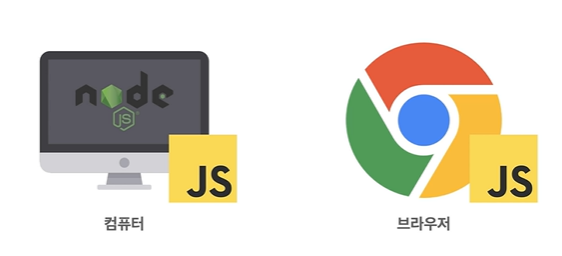
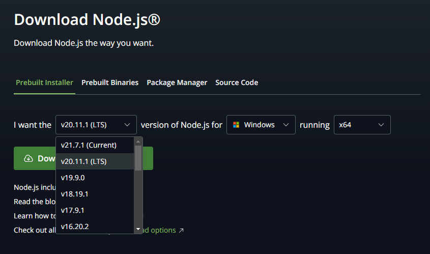

# Ch1. Node.js

## 개요
Chrome V8 JavaScript 엔진으로 빌드된 JavaScript 런타임
(JavaScript runtime - 프로그래밍 언어가 동작하는 환경)

JavaScript가 동작할수 있는 환경은 크게 두가지가 있다

## 설치
[다운로드](https://nodejs.org/en/download)

LTS(Long Term Supported)는 장기적으로 안정되고 신뢰도가 높은 지원이 보장되는 버전, 유지/보수와 보안(서버운영 등)에 초점이 맞춰짐 (짝수버전) 권장버전

Current는 최신버전으로 LTS에는 없는 최신기능들이 제공되지만 업데이트가 자주 일어날수 있고, 그만큼 변경사항이 많을수 있어 안정적이지 않을 수 있다 (홀수버전)

## NVM 설치 및 사용법
nvm-window 검색
혹은
[다운로드](https://github.com/coreybutler/nvm-windows)
[설치 및 사용법](https://blog.naver.com/jmb2981/223190294189)

