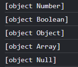

# JavaScript

## 프로젝트 초기화
package.json생성
```bash
npm init -y
```
parcel 패키지 설치
```bash
npm i -D parcel-bundler
```
scripts 작성
```json
"dev": "parcel index.html"
"build": "parcel build index.html"
```
scripts 명령어 실행
```bash
npm run dev
```

## 데이터 타입확인

### typeof
```javascript
console.log(typeof 'Hello World')  //string
console.log(typeof 123)  //number
console.log(typeof true)  //boolean
console.log(typeof undefined)  //undefined
console.log(typeof null)  //object
console.log(typeof {})  //object
console.log(typeof [])  //object
```

typeof라는 키워드로는 객체데이터와 배열 데이터를 정확하게 구분해서 확인하기 어렵다

그래서 하나의 함수를 만들어 type을 구분해볼 수 있다

### 함수
```javascript
function getType(data) {
  return Object.prototype.toString.call(data)
}
console.log(getType(123)) // [Object Number]
console.log(getType(true)) //[Object Boolean]
console.log(getType({})) // [Object Object]
console.log(getType([])) // [Object Array]
console.log(getType(null)) // [Object Null]
```


.slice(8, -1)을 붙여주면
```javascript
function getType(data) {
  return Object.prototype.toString.call(data).slice(8, -1)
}

console.log(123) //Number
console.log(true) //Boolean
console.log({}) //Object
console.log([]) //Array
console.log(null) //Null
```


## 변수 요휴범위 (Variable Scope)
keyword - var, let, const (var는 권장되지 않음)
```javascript
function scope() {
  if(true) {
    const a = 123;
    console.log(a)
  }
}
scope();
```

```javascript
function scope() {
  if(true) {
    const a = 123;
  }
  console.log(a)
}

function scope() {
  console.log(a)
  if(true) {
    const a = 123;
  }
}
```

if문 안에 있는 console.log(a)를 if문 밖으로 이동할 경우 'a is not defined at scope'라는 에러 메시지가 출력된다
'let' 또는 'const'라는 keyword는 변수가 선언되어져 있는 블록({}) 내부안에서만 유효범위를 가지기 때문이다

```javascript
function scope() {
  if(true) {
    console.log(a)
    const a = 123;
  }
}
```
선언한 변수 위로 이동시켜보면 undefined 출력된다
이 경우 변수가 동작할 수 있는 유효범위 안에 존재하기는 하지만 a라는 값이 할당되는 코드보다 먼저 출력이 되기 때문에 'undefined' 값이 지정되 있지 않다라는 메시지가 출려되는 것이다

즉, 'let'과 'const'같은 경우 블록레벨의 범위를 가진다고 할 수 있다.

```javascript
function scope() {
  console.log(a)
  if(true) {
    var a = 123;
  }
}

// undefined
```
'const' keyword를 'var'로 바꾸면 'undefined'가 출력된다   
이 경우 변수 a가 있긴 하지만 아직 값이 지정되지 않은 상태라는 것을 알 수 있다
'var'라는 keyword는 블록레벨의 유효범위가 아닌 함수레벨의 유효범위를 가지고 있기 때문에 함수안에서는 어디서든지 쓸 수 있다.
함수 안이라면 변수 선언 이후에 위치만 한다면 어디서든 값이 출력된다

```javascript
function scope() {
  if(true) {
    var a = 123;
  }
  console.log(a)
}

// 123
```
위와 같이 'var'를 사용하여 변수 선언을 할 경우 'const'나 'let'을 썼을 경우와 다르게 정상적으로 값이 출력된다


## 형변환 (Type conversion)
```javascript
const a = 1; //type = Number
const b = '1'; // type = String

console.log( a === b ); // false
console.log( a == b ); // true
```
일치 연산자를 사용할 경우 a 와 b의 type이 다르기 때문에 'false'가 출력된다
 (일치 연산자 '===')
동등 연산자를 사용할 경우 형변환이라는 변환이 일어나서 'true'가 출력된다 
의도하지 않은 형변환이 일어나게 되게 때문에 권장하지 않는다
 (동등 연산자 '==')

 - Truthy(참 같은 값)
 true, {}, [], 1, 2, 'false', -12, '3.14' ...

 - Falsy(거짓 같은 값) 
 false, '', null, undefined, 0, -0, NaN


